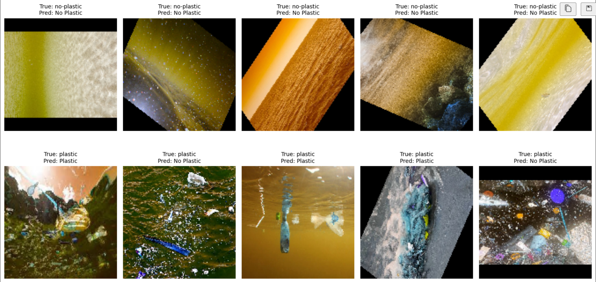

# Marine-waste-detection-Model
# Marine Waste Detection Model

## Overview
This project focuses on building a machine learning model to detect marine waste from images. By leveraging advanced computer vision techniques and deep learning, the model aims to identify and classify waste materials in aquatic environments, contributing to environmental conservation efforts.

## Features
- **Image Classification**: Detects and classifies different types of waste in marine environments.
- **Real-Time Prediction**: Supports integration with live camera feeds for real-time waste detection.
- **Scalable Design**: Easily extendable for additional waste categories or environments.

## Technologies Used
- **Python**: Core programming language for the project.
- **TensorFlow/Keras**: Used for building and training the deep learning model.
- **NVIDIA CUDA & CUDNN**: Deep learning functionalities and framework
- **OpenCV**: For image processing and integration with camera feeds.
- **Matplotlib & Seaborn**: For data visualization and performance metrics.
- **Git**: Version control.
  
## WSL Environment Notes

This project is developed in a Windows Subsystem for Linux (WSL) environment using VS Code and Jupyter Notebook. While the model supports live camera feeds using OpenCV, WSL cannot access the laptop's webcam directly. Windows users can integrate the OpenCV camera feed if running the project natively on Windows.

For faster training, this project utilizes a laptop with an NVIDIA dedicated GPU.

## Dataset
The dataset consists of labeled images of various types of marine waste, collected from kaggle. The dataset is divided into training, validation, and test sets to ensure robust model performance.

## Contributing
Contributions are welcome! Please follow these steps:
1. Fork the repository.
2. Create a new branch for your feature or bug fix.
3. Submit a pull request with a detailed description of your changes.

## License
This project is licensed under the [MIT License](LICENSE).

## Acknowledgments
Special thanks to contributors and open-source datasets used in this project.

## Screenshots

